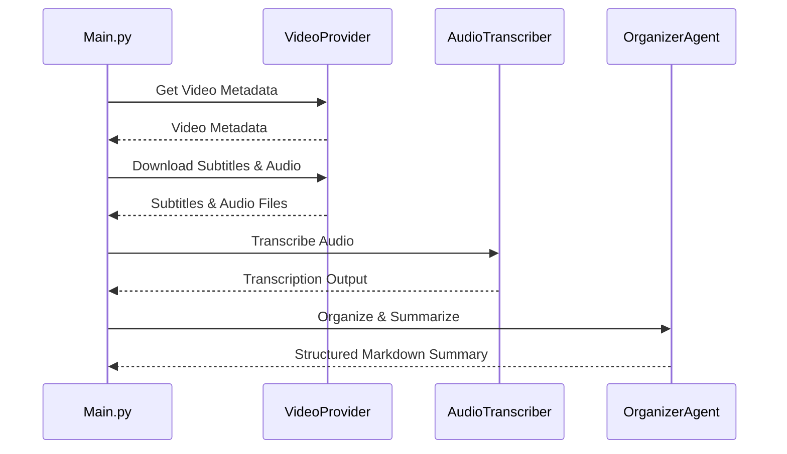

# 🎙️ Video Transcriber & AI Summarizer

This Python script allows you to **extract, transcribe, and intelligently organize audio from videos** on **YouTube**, **TikTok**, or **Instagram**, using local speech-to-text models and AI-powered content organization.

---

## ✨ Features

- **Video Information Extraction:** Retrieves and displays comprehensive metadata (title, duration, uploader, description, etc.) for YouTube, TikTok, or Instagram videos.
- **Automatic Subtitle Extraction:** Downloads subtitles from YouTube if available.
- **Audio Transcription:** Downloads audio and transcribes it using:
  - ✅ [faster-whisper](https://github.com/guillaumekln/faster-whisper) *(default, lightweight & fast)*
  - 🧠 [openai-whisper](https://github.com/openai/whisper)
- **AI-Powered Content Organization:** Uses local LLM (via LM Studio) to:
  - Organize transcriptions by topics and themes
  - Generate structured Markdown summaries with headings, lists, and code snippets
  - Optionally enrich content with internet research for deeper context
- **Internet Research Integration:** When enabled, the AI can fetch additional information from the internet to provide richer, more comprehensive summaries.
- **Hexagonal Architecture:** Clean separation of concerns with ports and adapters pattern for:
  - Easy extensibility and testing
  - Swappable components (transcription engines, LLM providers, output formats)
  - Clear domain/application/infrastructure boundaries
- **Organized Output Management:**
  - Plain text transcriptions saved in `outputs/transcriptions/`
  - AI-organized Markdown summaries saved in `outputs/summaries/`
  - Automatic folder creation and file naming based on video metadata
- **Flexible Configuration:** Command-line options for models, language, LLM selection, and feature toggles.

## ⚙️ Requirements

- Python 3.12 or higher
- `ffmpeg` installed and in your system path
- [LM Studio](https://lmstudio.ai/) installed and running locally for AI features

### Creating a Virtual Environment

#### Option 1: Using `uv` (Recommended)

Install `uv` from [https://docs.astral.sh/uv/](https://docs.astral.sh/uv/)

```bash
# Create virtual environment and install dependencies
uv sync

# Activate virtual environment (macOS/Linux)
source .venv/bin/activate

# Or use uv run to execute commands directly
uv run python src/main.py <VIDEO_URL>
```

#### Option 2: Using `venv`

Create and activate a virtual environment:

```bash
# Create virtual environment
python -m venv venv

# Activate (macOS/Linux)
source venv/bin/activate

# Install dependencies
pip install -r src/requirements.txt
```

### LM Studio

Make sure LM Studio is running and a model is loaded:

1. Download and install [LM Studio](https://lmstudio.ai/)
2. Open LM Studio and load a model (recommended: `llama3`, `mistral`, or `neural-chat`)
3. Start the local server (usually runs on `http://localhost:1234/v1` by default)

#### Configuration

Create a `.env` file in the project root to configure LM Studio connection:

```bash
cp .env.example .env
```

Edit `.env` with your LM Studio settings:

```bash
LM_STUDIO_BASE_URL=http://localhost:1234/v1
LM_STUDIO_API_KEY=not-needed
LM_STUDIO_MODEL=local-model
```

Or set environment variables directly:

```bash
export LM_STUDIO_BASE_URL="http://localhost:1234/v1"
export LM_STUDIO_API_KEY="not-needed"
export LM_STUDIO_MODEL="local-model"
```


## 🚀 Usage

```bash
python main.py <VIDEO_URL> [options]
```

### 🧠 Options

| Argument                    | Description                                                                         | Default          |
|-----------------------------|-------------------------------------------------------------------------------------|------------------|
| `url`                       | Video URL (YouTube, TikTok, Instagram)                                              | **Required**     |
| `--transcript-model`, `-tm` | Transcription model: `faster-whisper` or `openai-whisper`                           | `faster-whisper` |
| `--lang`, `-l`              | Language code (`en`, `es`, `fr`, etc.)                                              | `en`             |
| `--llm-model`               | LLM model loaded in LM Studio (e.g., `llama3`, `mistral`, `neural-chat`)            | `local-model`    |
| `--enrich-text`             | Enable internet research to enrich the content with additional context              | `False`          |

### 📺 Examples

Basic transcription and AI summary:

```bash
python src/main.py "https://www.youtube.com/watch?v=dQw4w9WgXcQ"
```

With custom models and language:

```bash
python src/main.py "https://www.tiktok.com/@love1980songs/video/7523531141589126414" \
  --model openai-whisper \
  --lang en \
  --llm-model llama3
```

With internet enrichment for comprehensive analysis:

```bash
python src/main.py "https://www.youtube.com/watch?v=educational_video" \
  --llm-model llama3 \
  --enrich-text
```

## 🏗️ Architecture



## 📦 Output Structure

```
outputs/
├── transcriptions/           # Raw transcription files
│   └── transcription.txt     # Plain text transcription
└── summaries/               # AI-organized content
    └── transcription_by_topic.md  # Structured Markdown summary
```

### Output Features

- **Transcriptions**: Clean, timestamped text files for archival and reference
- **Summaries**: AI-organized Markdown files with:
  - Structured headings and sections
  - Key topic extraction and organization
  - Important quotes and highlights
  - Optional internet-researched context and background information

## 🔧 Available LLM Models

Popular models you can load in LM Studio with `--llm-model`:

- `llama3` (high quality, recommended)
- `mistral` (fast and efficient)
- `neural-chat` (optimized for conversation)
- Any other GGUF model compatible with LM Studio

Download models directly in LM Studio from Hugging Face or load them from the local file system.

## 🌐 Internet Enrichment

When `--enrich-text` is enabled, the AI will:

- Research topics mentioned in the video
- Provide additional context and background information
- Include relevant links and references
- Enhance technical explanations with current information

**Note**: Internet enrichment requires an active internet connection and may increase processing time.

## 🛠 Future Enhancements

- Database integration for transcription storage and search
- Web UI for easier interaction
- Batch processing for multiple videos
- Custom prompt templates for different content types
- Integration with more LLM providers (OpenAI, Anthropic, etc.)
- Real-time transcription for live streams
