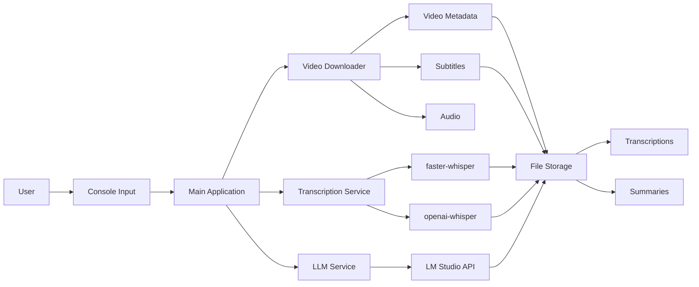
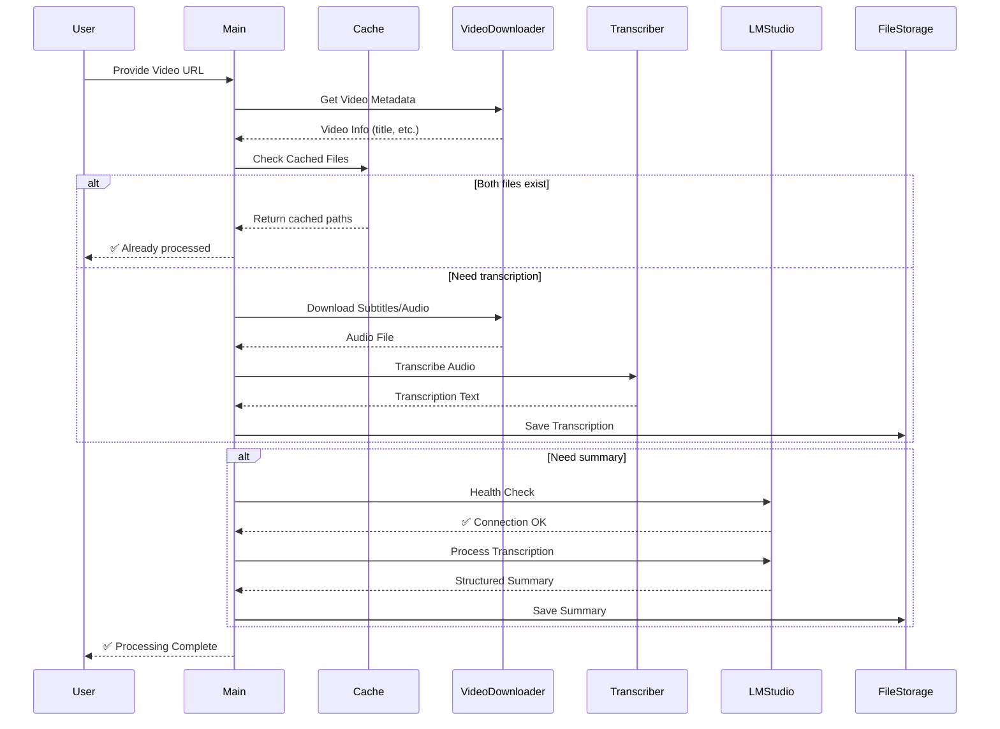

# 🏗️ Architecture Documentation

## Overview

The Video Transcriber & AI Summarizer is built using **hexagonal architecture** (also known as ports and adapters pattern) to ensure clean separation of concerns, testability, and extensibility.

## System Overview


```mermaid
graph LR
    A[User] --> B[Console Input]
    B --> C[Main Application]
    C --> D[Video Downloader]
    C --> E[Transcription Service]
    C --> F[LLM Service]
    
    D --> G[Video Metadata]
    D --> H[Subtitles]
    D --> I[Audio]
    
    E --> J[faster-whisper]
    E --> K[openai-whisper]
    
    F --> L[LM Studio API]
    
    G --> M[File Storage]
    H --> M
    J --> M
    K --> M
    L --> M
    
    M --> N[Transcriptions]
    M --> O[Summaries]
```

## Processing Flow


```mermaid
sequenceDiagram
    participant User
    participant Main
    participant Cache
    participant VideoDownloader
    participant Transcriber
    participant LMStudio
    participant FileStorage
    
    User->>Main: Provide Video URL
    Main->>VideoDownloader: Get Video Metadata
    VideoDownloader-->>Main: Video Info (title, etc.)
    
    Main->>Cache: Check Cached Files
    alt Both files exist
        Cache-->>Main: Return cached paths
        Main-->>User: ✅ Already processed
    else Need transcription
        Main->>VideoDownloader: Download Subtitles/Audio
        VideoDownloader-->>Main: Audio File
        Main->>Transcriber: Transcribe Audio
        Transcriber-->>Main: Transcription Text
        Main->>FileStorage: Save Transcription
    end
    
    alt Need summary
        Main->>LMStudio: Health Check
        LMStudio-->>Main: ✅ Connection OK
        Main->>LMStudio: Process Transcription
        LMStudio-->>Main: Structured Summary
        Main->>FileStorage: Save Summary
    end
    
    Main-->>User: ✅ Processing Complete
```

## Hexagonal Architecture

The project follows hexagonal (ports & adapters) architecture:

```
src/
├── application/              # Business logic (domain layer)
│   └── transcription/
│       └── services/         # Application services
│           ├── transcription_service.py
│           ├── video_downloader_service.py
│           └── llm_markdown_service.py
├── infrastructure/
│   ├── inbound/             # Input adapters (driving side)
│   │   └── console/         # CLI adapter
│   │       ├── ports/       # Input port interfaces
│   │       └── adapters/    # CLI implementation
│   └── outbound/            # Output adapters (driven side)
│       ├── agents/          # LLM adapters
│       │   ├── ports/       # LLM port interfaces
│       │   └── adapters/    # LM Studio implementation
│       ├── transcriber/     # Speech-to-text adapters
│       │   ├── ports/       # Transcriber interfaces
│       │   └── adapters/    # Whisper implementations
│       ├── video_downloader/# Video download adapters
│       │   ├── ports/       # Downloader interfaces
│       │   └── adapters/    # yt-dlp implementation
│       └── file_storage/    # File system adapters
│           ├── ports/       # Storage interfaces
│           └── adapters/    # Local file storage
```

## Layers Explained

### 1. Domain/Application Layer (`application/`)

Contains **business logic** and **use cases**. This layer is independent of frameworks, databases, or external services.

**Key Services:**
- `transcription_service.py` - Orchestrates the transcription process
- `video_downloader_service.py` - Video metadata extraction
- `llm_markdown_service.py` - Summary generation orchestration

**Characteristics:**
- No external dependencies
- Pure business logic
- Testable in isolation

### 2. Infrastructure Layer (`infrastructure/`)

Contains **adapters** that connect the application to external systems.

#### Inbound Adapters (Driving Side)
**What they do:** Receive external requests and translate them into domain operations

- **Console Adapter**: Parses command-line arguments and invokes application services

#### Outbound Adapters (Driven Side)
**What they do:** Implement port interfaces to interact with external systems

- **Agent Adapters**: Connect to LLM providers
  - Current: LM Studio (local LLM server)
  - Future: Cloud LLM adapter planned as replacement
- **Transcriber Adapters**: Implement speech-to-text engines
- **Video Downloader Adapters**: Handle video platform APIs
- **File Storage Adapters**: Manage file system operations

### 3. Ports

**Ports** are interfaces that define contracts between layers.

- **Input Ports**: Define what the application can do (e.g., `UserInputPort`)
- **Output Ports**: Define what the application needs (e.g., `AudioTranscriberPort`, `SummarizerAgent`)

## Benefits of This Architecture

### 1. **Flexibility**
Easy to swap implementations without changing business logic:
- Switch from LM Studio to cloud LLM provider (OpenAI, Anthropic, etc.)
- Add database storage alongside file storage
- Replace CLI with Web UI or API

### 2. **Testability**
Each layer can be tested independently:
- Unit test domain logic without external dependencies
- Mock ports for integration testing
- Test adapters in isolation

### 3. **Maintainability**
Clear boundaries and responsibilities:
- Business logic is centralized
- Changes to external systems don't affect domain
- New adapters can be added without modifying existing code

### 4. **Dependency Inversion**
- Core business logic doesn't depend on infrastructure
- Infrastructure depends on domain interfaces
- Follows SOLID principles

## Component Interactions

### Example: Transcription Flow

1. **Console Adapter** (inbound) receives URL from user
2. **Main Application** validates and prepares request
3. **Video Downloader Adapter** (outbound) fetches video metadata
4. **Cache Check** via File Storage Adapter
5. If needed:
   - **Video Downloader** downloads audio
   - **Transcriber Adapter** processes audio
   - **File Storage Adapter** saves transcription
6. **LLM Agent Adapter** generates summary
7. **File Storage Adapter** saves summary
8. **Console Adapter** displays results to user

## Adding New Adapters

### Example: Adding Cloud LLM Support

1. **Create new adapter** in `infrastructure/outbound/agents/adapters/`:
   ```python
   class SummarizerCloudAgent(SummarizerAgent):
       def organize_transcription(self, transcription, video_info, lang, enrich_text):
           # Cloud LLM API implementation
   ```

2. **No changes needed** to:
   - Application services
   - Port interfaces
   - Other adapters

3. **Update configuration** to select adapter:
   ```python
   if llm_provider == "cloud":
       return SummarizerCloudAgent()
   elif llm_provider == "lmstudio":
       return SummarizerLMStudioAgent()
   ```

## Caching Strategy

The application implements **smart caching** at multiple levels:

1. **Application Level** (`main.py`):
   - Checks if both transcription and summary exist
   - Exits early if both files found
   - Provides user feedback

2. **Service Level** (`transcription_service.py`, `llm_markdown_service.py`):
   - Checks for individual file existence
   - Returns cached content if available
   - Continues processing only if needed

3. **Storage Level** (`file_storage_port.py`):
   - Provides `exists()` and `read()` methods
   - Abstracts file system operations
   - Could be extended to support database caching

## Error Handling Strategy

**Layered error handling:**

1. **Adapter Level**: Catches low-level errors (network, file I/O)
2. **Service Level**: Business logic validation
3. **Application Level**: User-facing error messages
4. **Health Checks**: Proactive connection verification

**Example: LM Studio Connection**
- Health check on initialization
- Timeout configuration
- Detailed error messages with troubleshooting steps
- Graceful degradation when possible

## Configuration Management

**Decentralized approach:**
- Each adapter reads environment variables independently via `os.getenv()`
- No centralized configuration service
- Configuration values are accessed directly where needed
- Easy to trace which adapter uses which environment variables

## Future Architecture Considerations

### Planned Enhancements

1. **Event-Driven Architecture**:
   - Emit events for transcription/summary completion
   - Enable webhooks or notifications

2. **Plugin System**:
   - Dynamic adapter loading
   - Third-party integrations

3. **Batch Processing**:
   - Queue-based processing
   - Parallel video handling

4. **Async Operations**:
   - Non-blocking I/O for downloads
   - Concurrent transcription

---

[← Back to README](../README.md)
